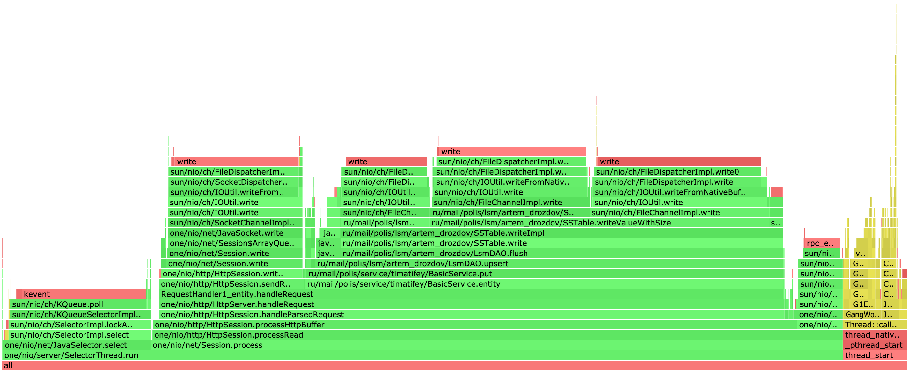
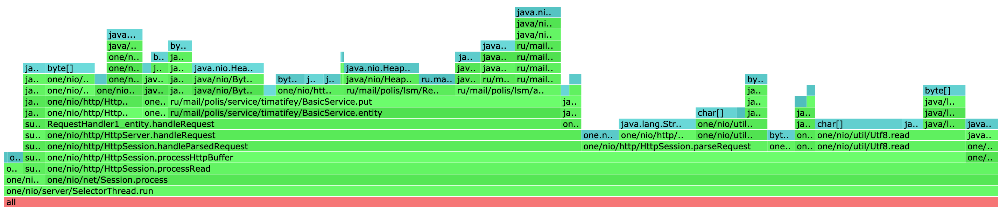
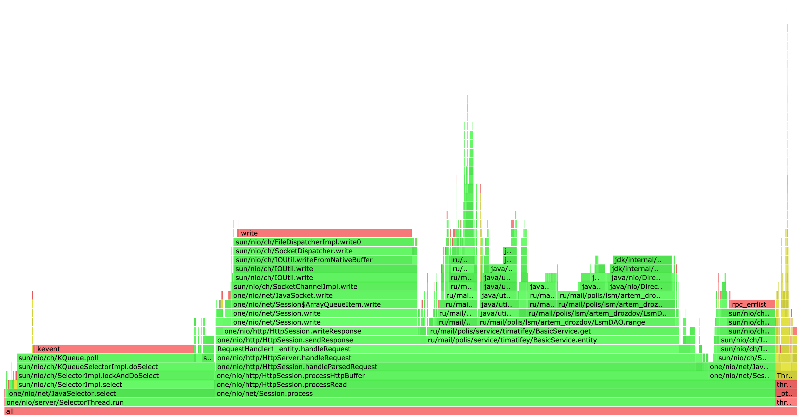
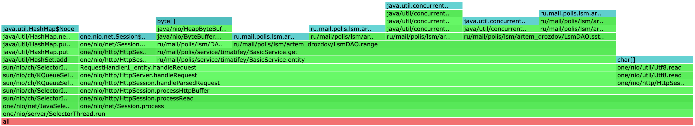

## Этап 1. HTTP + storage (deadline 2021-09-29 23:59:59 MSK)
### Задание

Проведите нагрузочное тестирование с помощью [wrk](https://github.com/giltene/wrk2) в **одно соединение**:
* `PUT` запросами на **стабильной** нагрузке (`wrk` должен обеспечивать заданный с помощью `-R` rate запросов)
* `GET` запросами на **стабильной** нагрузке по **наполненной** БД

Приложите полученный консольный вывод `wrk` для обоих видов нагрузки.

Отпрофилируйте приложение (CPU и alloc) под `PUT` и `GET` нагрузкой с помощью [async-profiler](https://github.com/jvm-profiling-tools/async-profiler).
Приложите SVG-файлы FlameGraph `cpu`/`alloc` для `PUT`/`GET` нагрузки.

**Объясните** результаты нагрузочного тестирования и профилирования и приложите **текстовый отчёт** (в Markdown).

### Ход работы

Запустим сервер
```
$ ./gradlew run
```
#### PUT запросы
Проведем нагрузочное тестирование с помощью wrk2 в одно соединение PUT запросами, используя [скрипт](scripts/put.lua):
```
counter = 0

request = function()
   path = "/v0/entity?id=key" .. counter
   wrk.method = "PUT"
   wrk.body = "value" .. counter
   counter = counter + 1
   return wrk.format(nil, path)
end
```

Для этого введем команду:
```
$ wrk2 -c1 -t1 -d3m -R2000 -s scripts/put.lua --latency http://localhost:8080 > wrk-put-report
```

Параллельно начнем профилирование, узнав перед этим PID процесса с помощью `jps`.
```
$ jps
6082 GradleDaemon
6934 Server
8488 GradleDaemon
6953 Jps
6921 GradleWrapperMain
94250 

$ ./profiler.sh -d 60 -f put-cpu.html 6934
$ ./profiler.sh -d 60 -e alloc -f put-alloc.html 6934
```

Результаты [тестирования](put/wrk-put-report)
```
Running 1m test @ http://localhost:8080
  1 threads and 1 connections
  Thread calibration: mean lat.: 1.866ms, rate sampling interval: 10ms
  Thread Stats   Avg      Stdev     Max   +/- Stdev
    Latency    67.41ms  322.03ms   2.44s    95.46%
    Req/Sec     2.12k     1.58k   26.44k    94.79%
  Latency Distribution (HdrHistogram - Recorded Latency)
 50.000%    1.28ms
 75.000%    1.78ms
 90.000%    2.33ms
 99.000%    2.00s 
 99.900%    2.40s 
 99.990%    2.44s 
 99.999%    2.44s 
100.000%    2.44s 

  Detailed Percentile spectrum:
       Value   Percentile   TotalCount 1/(1-Percentile)

       0.067     0.000000            1         1.00
       0.425     0.100000        10020         1.11
       0.688     0.200000        20003         1.25
       0.927     0.300000        30038         1.43
       1.124     0.400000        40010         1.67
       1.276     0.500000        50006         2.00
       1.350     0.550000        55017         2.22
       1.425     0.600000        60035         2.50
       1.509     0.650000        65038         2.86
       1.627     0.700000        69995         3.33
       1.780     0.750000        74992         4.00
       1.867     0.775000        77497         4.44
       1.955     0.800000        80013         5.00
       2.042     0.825000        82502         5.71
       2.135     0.850000        85018         6.67
       2.225     0.875000        87494         8.00
       2.279     0.887500        88777         8.89
       2.333     0.900000        90002        10.00
       2.393     0.912500        91257        11.43
       2.471     0.925000        92514        13.33
       2.659     0.937500        93741        16.00
      10.991     0.943750        94365        17.78
     178.815     0.950000        94990        20.00
     463.359     0.956250        95615        22.86
     746.495     0.962500        96240        26.67
    1032.703     0.968750        96865        32.00
    1175.551     0.971875        97177        35.56
    1318.911     0.975000        97490        40.00
    1462.271     0.978125        97804        45.71
    1604.607     0.981250        98115        53.33
    1746.943     0.984375        98427        64.00
    1818.623     0.985938        98583        71.11
    1888.255     0.987500        98741        80.00
    1958.911     0.989062        98896        91.43
    2029.567     0.990625        99052       106.67
    2095.103     0.992188        99209       128.00
    2131.967     0.992969        99289       142.22
    2166.783     0.993750        99365       160.00
    2203.647     0.994531        99446       182.86
    2238.463     0.995313        99522       213.33
    2273.279     0.996094        99599       256.00
    2291.711     0.996484        99640       284.44
    2308.095     0.996875        99677       320.00
    2326.527     0.997266        99718       365.71
    2344.959     0.997656        99759       426.67
    2361.343     0.998047        99795       512.00
    2369.535     0.998242        99814       568.89
    2379.775     0.998437        99836       640.00
    2387.967     0.998633        99855       731.43
    2396.159     0.998828        99873       853.33
    2404.351     0.999023        99892      1024.00
    2410.495     0.999121        99905      1137.78
    2414.591     0.999219        99915      1280.00
    2418.687     0.999316        99924      1462.86
    2422.783     0.999414        99934      1706.67
    2426.879     0.999512        99944      2048.00
    2428.927     0.999561        99950      2275.56
    2428.927     0.999609        99950      2560.00
    2430.975     0.999658        99963      2925.71
    2430.975     0.999707        99963      3413.33
    2433.023     0.999756        99970      4096.00
    2433.023     0.999780        99970      4551.11
    2433.023     0.999805        99970      5120.00
    2435.071     0.999829        99977      5851.43
    2435.071     0.999854        99977      6826.67
    2435.071     0.999878        99977      8192.00
    2437.119     0.999890        99982      9102.22
    2437.119     0.999902        99982     10240.00
    2437.119     0.999915        99982     11702.86
    2437.119     0.999927        99982     13653.33
    2439.167     0.999939        99989     16384.00
    2439.167     1.000000        99989          inf
#[Mean    =       67.414, StdDeviation   =      322.035]
#[Max     =     2437.120, Total count    =        99989]
#[Buckets =           27, SubBuckets     =         2048]
----------------------------------------------------------
  119996 requests in 1.00m, 7.67MB read
Requests/sec:   1999.94
Transfer/sec:    130.86KB
```

[Результаты профилирования PUT cpu](put/put-cpu.html)


[Результаты профилирования PUT alloc](put/put-alloc.html)


#### GET запросы
Теперь проведем тестирование GET запросами через [скрипт](scripts/get.lua):
```
counter = 0

request = function()
   path = "/v0/entity?id=key" .. counter
   wrk.method = "GET"
   counter = counter + 1
   return wrk.format(nil, path)
end
```

введем команду:
```
$ wrk2 -c1 -t1 -d3m -R2000 -s scripts/get.lua --latency http://localhost:8080 > wrk-get-report
```

Также начнем профилирование
```
$ ./profiler.sh -d 60 -f get-cpu.html 6934
$ ./profiler.sh -d 60 -e alloc -f get-alloc.html 6934
```

Результаты [тестирования](get/wrk-get-report)
```
Running 3m test @ http://localhost:8080
  1 threads and 1 connections
  Thread calibration: mean lat.: 3.238ms, rate sampling interval: 10ms
  Thread Stats   Avg      Stdev     Max   +/- Stdev
    Latency     1.34ms    1.34ms  49.89ms   98.35%
    Req/Sec     2.11k   263.41    10.11k    78.96%
  Latency Distribution (HdrHistogram - Recorded Latency)
 50.000%    1.25ms
 75.000%    1.69ms
 90.000%    2.17ms
 99.000%    3.49ms
 99.900%   18.82ms
 99.990%   46.43ms
 99.999%   49.57ms
100.000%   49.92ms

  Detailed Percentile spectrum:
       Value   Percentile   TotalCount 1/(1-Percentile)

       0.062     0.000000            1         1.00
       0.427     0.100000        34043         1.11
       0.679     0.200000        68035         1.25
       0.907     0.300000       102006         1.43
       1.101     0.400000       136174         1.67
       1.254     0.500000       170027         2.00
       1.324     0.550000       187033         2.22
       1.397     0.600000       204058         2.50
       1.474     0.650000       221171         2.86
       1.567     0.700000       238063         3.33
       1.688     0.750000       255078         4.00
       1.759     0.775000       263525         4.44
       1.838     0.800000       272002         5.00
       1.919     0.825000       280547         5.71
       2.000     0.850000       289013         6.67
       2.085     0.875000       297542         8.00
       2.129     0.887500       301791         8.89
       2.175     0.900000       306092        10.00
       2.221     0.912500       310381        11.43
       2.269     0.925000       314560        13.33
       2.323     0.937500       318893        16.00
       2.351     0.943750       320936        17.78
       2.381     0.950000       322990        20.00
       2.415     0.956250       325221        22.86
       2.451     0.962500       327349        26.67
       2.491     0.968750       329419        32.00
       2.517     0.971875       330500        35.56
       2.543     0.975000       331507        40.00
       2.579     0.978125       332553        45.71
       2.633     0.981250       333634        53.33
       2.713     0.984375       334685        64.00
       2.803     0.985938       335223        71.11
       2.983     0.987500       335741        80.00
       3.269     0.989062       336273        91.43
       3.687     0.990625       336804       106.67
       4.291     0.992188       337333       128.00
       4.671     0.992969       337599       142.22
       5.099     0.993750       337865       160.00
       5.703     0.994531       338130       182.86
       6.475     0.995313       338396       213.33
       7.299     0.996094       338662       256.00
       7.855     0.996484       338794       284.44
       8.535     0.996875       338928       320.00
       9.231     0.997266       339060       365.71
       9.999     0.997656       339193       426.67
      11.239     0.998047       339325       512.00
      11.903     0.998242       339392       568.89
      12.887     0.998437       339458       640.00
      14.319     0.998633       339526       731.43
      16.207     0.998828       339591       853.33
      19.247     0.999023       339657      1024.00
      21.295     0.999121       339692      1137.78
      23.215     0.999219       339724      1280.00
      25.423     0.999316       339757      1462.86
      27.439     0.999414       339790      1706.67
      30.047     0.999512       339823      2048.00
      32.447     0.999561       339840      2275.56
      35.487     0.999609       339858      2560.00
      37.599     0.999658       339873      2925.71
      40.479     0.999707       339890      3413.33
      42.175     0.999756       339906      4096.00
      42.943     0.999780       339915      4551.11
      43.871     0.999805       339923      5120.00
      44.223     0.999829       339931      5851.43
      44.895     0.999854       339940      6826.67
      45.695     0.999878       339950      8192.00
      46.047     0.999890       339952      9102.22
      46.431     0.999902       339956     10240.00
      46.783     0.999915       339960     11702.86
      47.551     0.999927       339965     13653.33
      48.127     0.999939       339969     16384.00
      48.319     0.999945       339971     18204.44
      48.639     0.999951       339973     20480.00
      48.767     0.999957       339975     23405.71
      48.863     0.999963       339977     27306.67
      49.023     0.999969       339979     32768.00
      49.055     0.999973       339980     36408.89
      49.183     0.999976       339981     40960.00
      49.215     0.999979       339982     46811.43
      49.311     0.999982       339984     54613.33
      49.311     0.999985       339984     65536.00
      49.343     0.999986       339985     72817.78
      49.343     0.999988       339985     81920.00
      49.567     0.999989       339986     93622.86
      49.567     0.999991       339986    109226.67
      49.727     0.999992       339987    131072.00
      49.727     0.999993       339987    145635.56
      49.727     0.999994       339987    163840.00
      49.887     0.999995       339988    187245.71
      49.887     0.999995       339988    218453.33
      49.887     0.999996       339988    262144.00
      49.887     0.999997       339988    291271.11
      49.887     0.999997       339988    327680.00
      49.919     0.999997       339989    374491.43
      49.919     1.000000       339989          inf
#[Mean    =        1.342, StdDeviation   =        1.341]
#[Max     =       49.888, Total count    =       339989]
#[Buckets =           27, SubBuckets     =         2048]
----------------------------------------------------------
  359997 requests in 3.00m, 25.29MB read
  Non-2xx or 3xx responses: 1
Requests/sec:   1999.98
Transfer/sec:    143.87KB
```
[Результаты профилирования GET cpu](get/get-cpu.html)


[Результаты профилирования GET alloc](get/get-alloc.html)
